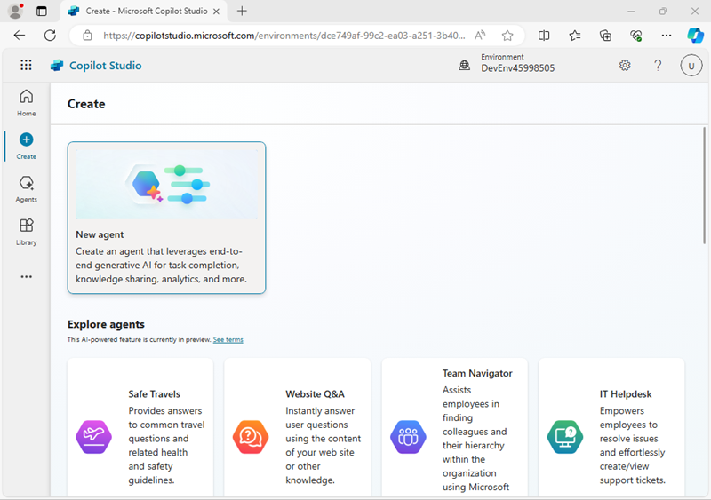
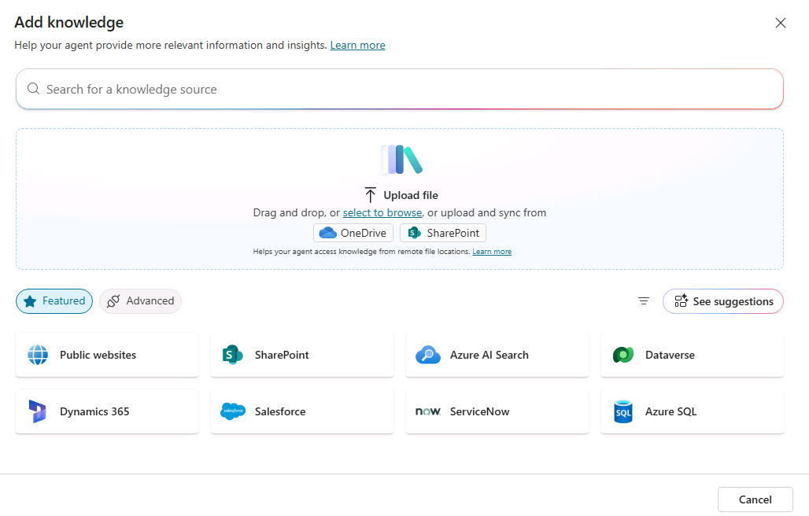
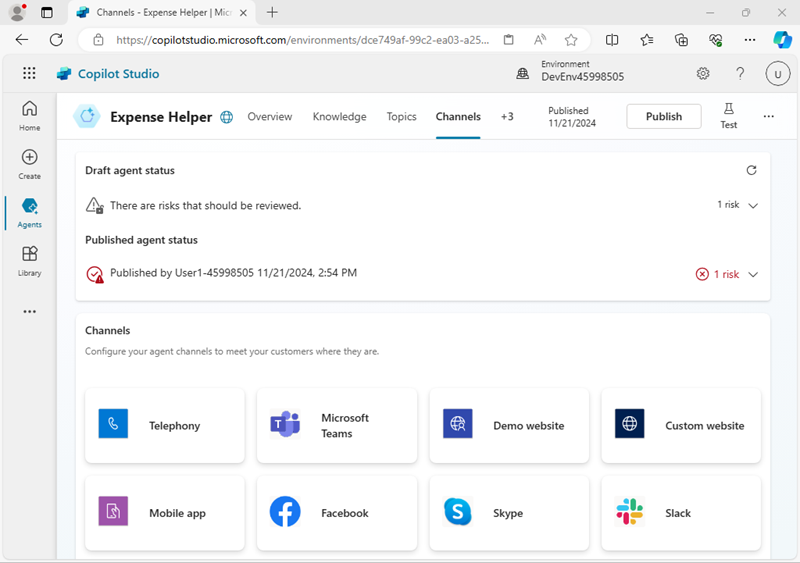
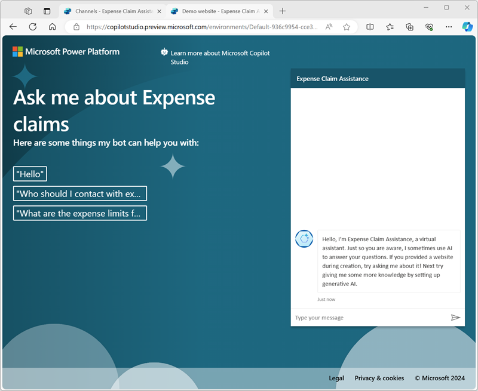

---
lab:
  title: Creación de un agente con Copilot Studio
---

# Creación de un agente con Copilot Studio

En este ejercicio, usarás Copilot Studio para crear un agente sencillo que pueda responder a preguntas de los empleados sobre las directivas de gastos de una empresa ficticia.

Este ejercicio tardará aproximadamente **45** minutos en completarse.

> **Nota**: este ejercicio presupone que ya tienes una licencia de Copilot Studio o que te has suscrito a una [prueba gratuita](https://go.microsoft.com/fwlink/p/?linkid=2252605).

## Crear un agente

Comencemos con Copilot Studio para crear un nuevo agente. El agente tendrá inicialmente funcionalidades muy limitadas, que se extenderán más adelante en el ejercicio.

1. En un explorador web, ve a [Copilot Studio](https://copilotstudio.microsoft.com/) en `https://copilotstudio.microsoft.com/` e inicia sesión con tu cuenta profesional o educativa si se te solicita. Omite los mensajes de bienvenida.

    > **Nota:** la primera vez que abras Copilot Studio, puede mostrar una interfaz de chat para crear el primer agente. Si esto ocurre, haz clic en el menú **...** de la parte superior derecha (junto al botón **Crear**) y selecciona **Cancelar creación de agente** para salir de la interfaz de chat y ver la página principal de Copilot Studio.

1. Visualiza la página principal de Copilot Studio, que debe ser similar al siguiente:

    

    En la página principal, puedes empezar a crear un agente y ver los agentes con los que has trabajado recientemente. El entorno de **Power Apps** en el que se definen tus agentes se muestra en la parte superior de la página. También puedes ir a la página **Crear** para ver más opciones de creación de agentes y a la página **Agentes** para ver todos los agentes existentes.

    > **Nota**: además de los agentes que hayas creado, es posible que veas **Copilot para Microsoft 365**, que puedes extender con Copilot Studio.

1. En el panel de navegación de la izquierda, selecciona **Crear** para ver una página en la que puedes crear un nuevo agente, de la siguiente manera:

    

    Puedes crear un agente completamente nuevo o empezar con una plantilla. En este ejercicio, crearás un nuevo agente.

1. Selecciona la opción para crear un **Nuevo agente**. Copilot Studio responde al proporcionar una interfaz de chat en la que puedes describir la funcionalidad del agente que deseas compilar.

    >**Sugerencia**: puedes usar la opción **Omitir para configurar** para omitir la experiencia de creación de agentes basada en chat. En este ejercicio, usaremos la interfaz de chat.

1. Escribe la siguiente indicación:

    ```prompt
    Create an agent to help employees with expense claims.
    ```

1. Revisa la respuesta de Copilot Studio. El panel de chat debe ser similar al siguiente:

    

1. Continúa la conversación para definir el agente, que debe:
    - Tener un nombre adecuado
    - Usar un tono amable y profesional.
    - No usar ningún sitio web accesible públicamente para obtener la información (más adelante agregarás un origen de conocimiento para tu Copilot).
    - Evitar proporcionar consejos fiscales.
    
    Cuando hayas terminado, se muestra una vista previa de la interfaz de chat del agente junto a la conversación que se usa para crearla.

1. Cuando todo esté listo, selecciona **Crear** en la parte superior derecha para crear tu agente. Al cabo de un rato, se mostrará de esta manera (puedes desmarcar el panel de la izquierda para verlo con más claridad):

    

1. En el panel **Probar el agente**, escribe la siguiente solicitud:

    ```prompt
    Hello
    ```

    Revisa la respuesta, que debe ser un mensaje adecuado.

1. Ahora prueba la siguiente indicación:

    ```prompt
    Who should I contact about submitting an expense claim?
    ```

    Esta vez la respuesta puede ser adecuada, pero también es probable que sea bastante genérica. En una organización real, querrás que el agente proporcione una dirección de correo electrónico o un número de teléfono para que el usuario pueda ponerse en contacto con él.

1. Vamos a probar otra indicación:

    ```prompt
    What's the expense limit for a hotel stay?
    ```

    De nuevo, la respuesta puede ser adecuada, pero genérica. En una organización real, querrás que el agente proporcione una respuesta más específica en función de las directivas de gastos de la empresa.

1. Cierra el panel **Probar el agente**.

## Administración de *temas* en el agente

Puedes usar *temas* para proporcionar respuestas explícitas a *desencadenadores*, como preguntas o solicitudes comunes que esperas que escriban tus usuarios.

1. En la página de tu agente, selecciona la pestaña **Temas** para ver sus temas.

    
    
    El agente tiene algunos temas ***personalizados*** que se desencadenan con la entrada del usuario, y algunos temas adicionales del ***sistema*** que se desencadenan con eventos específicos, como errores o entradas inesperadas. Puedes filtrar los temas por categoría o usar el filtro **Todos** para verlos todos.

1. Selecciona el tema personalizado **Saludo** para verlo en el *lienzo de creación*, que es un diseñador visual para crear y editar temas y tiene un aspecto similar a este:

    

    El tema *Saludo* se desencadena con una entrada en la que haya una de las siguientes frases:

    - *Buenas tardes*
    - *Buenos días*
    - *Hello*
    - *Hola*
    - *Hola*

    La respuesta a este desencadenador es devolver un mensaje al usuario que dice *Hola, ¿cómo puedo ayudarle hoy?*. La inclusión de este tema en el agente explica la respuesta que has visto anteriormente al probarlo.

1. Vuelve a la página **Temas** y consulta los temas del **sistema**. Ten en cuenta que estos incluyen temas para eventos comunes en una conversación. En especial, ten en cuenta los siguientes temas del sistema:
    - **Refuerzo conversacional**: este tema se activa cuando el usuario envía un mensaje del el que el agente no puede identificar un tema correspondiente (se desconoce la *intención* del usuario). Entonces, el tema intenta responder al mensaje del usuario mediante IA generativa.
    - **Reserva**: este tema es un tema "para notificaciones de error" que responde cuando se desconoce la intención y no se puede generar una respuesta de IA conversacional adecuada. El tema alternativo usa la lógica para permitir que el usuario vuelva a intentarlo hasta tres veces antes de finalizar con gracia la conversación, a menudo dirigiéndolo a un operador humano.
1. Vuelve a la página **Temas**, y en el menú **+ Agregar un tema**, selecciona **Tema**\>**Crear a partir de la descripción con Copilot**.

1. En el cuadro de diálogo **Crear una descripción con Copilot**, asigna el nombre `Ask about expenses contact` al nuevo tema y escribe el siguiente texto para indicar a Copilot lo que debe hacer el tema:

    ```prompt
    When the user asks who to contact about expense claims, tell them to send an email to finance@contoso.com.
    ```

1. Selecciona **Crear**.

1. Después de una breve espera, debería crearse un nuevo tema denominado *Preguntar sobre el contacto de gastos* y abrirse en el lienzo de creación, donde debería tener un aspecto similar al siguiente:

    

    El nuevo tema debe desencadenarse mediante frases que pregunten sobre un contacto de gastos y respondan con un mensaje que indica al usuario que envíe un correo electrónico a la dirección adecuada.

1. Usa el botón **Guardar** (arriba a la derecha) para guardar el nuevo tema en tu agente.

1. Abre el panel **Probar** y escribe la siguiente solicitud:

    ```prompt
    Who should I contact about submitting an expense claim?
    ```

    Visualiza la respuesta, que debería basarse en el tema que acabas de agregar (aunque el texto que has introducido no coincida exactamente con ninguna de las frases del desencadenador, debería aproximarse lo suficiente desde el punto de vista semántico para desencadenar el tema).

## Adición de un origen de conocimiento para las respuestas de IA generativa

Puedes agregar temas para todas las entradas que esperas que escriba un usuario, pero no es realista esperar anticiparse a todas las preguntas que harán. Actualmente, tu agente usa un tema de *refuerzo de conversación* para generar respuestas de IA a partir de un modelo de lenguaje, pero esto da como resultado respuestas genéricas. Debes proporcionar un origen de conocimiento en el que las respuestas de IA generativa puedan *fundamentarse* para proporcionar información más relevante.

1. Abre una nueva pestaña del explorador y descarga el archivo [documento de directiva de gastos](https://raw.githubusercontent.com/MicrosoftLearning/mslearn-copilotstudio/main/expenses/Expenses_Policy.docx) de `https://github.com/MicrosoftLearning/mslearn-copilotstudio/raw/main/expenses/Expenses_Policy.docx` y guárdalo localmente. Este documento contiene detalles de la directiva de gastos de la empresa ficticia Contoso.

1. Vuelve a la pestaña del explorador de Copilot Studio, y cierra el panel **Probar el agente** para ver la página más fácilmente, después selecciona la pestaña **Conocimiento** para ver los orígenes de conocimiento definidos en tu agente (actualmente no debería haber ninguno).

    

1. Selecciona **+ Agregar conocimiento**, y anota los distintos tipos de origen de conocimiento que puedes agregar a tu agente.

    

1. En la sección **Cargar archivos**, carga el documento de la directiva de gastos que has descargado anteriormente y agrégalo al conocimiento de tu agente.

    > **Nota**: después de cargar el archivo, tendrás que esperar mientras se indexa; lo que puede tardar 10 minutos (o más). Ahora puede ser un buen momento para tomarse un café mientras revisas el documento [Directiva de gastos](https://github.com/MicrosoftLearning/mslearn-copilotstudio/raw/main/expenses/Expenses_Policy.docx) en `https://github.com/MicrosoftLearning/mslearn-copilotstudio/raw/main/expenses/Expenses_Policy.docx` en otra pestaña del explorador.

1. Cuando el archivo esté listo, consulta la página **Temas** y abre el tema del sistema **Refuerzo conversacional**. Recuerda que este tema se desencadena mediante una intención desconocida y después intenta crear una respuesta de IA generativa basada en orígenes de datos que contienen conocimiento, como el archivo que has cargado.

    > **Nota**: si no se encuentra ninguna respuesta relevante en los orígenes de conocimiento personalizados que has agregado, el tema puede usar el conocimiento inherente al modelo de lenguaje para proporcionar una respuesta más genérica. Puedes configurar el tema para restringir su búsqueda a almacenes de conocimiento específicos si deseas controlar mejor las respuestas de IA generativa que devuelve.

1. Expande el panel **Probar** y reinicia la conversación. Después, escribe la siguiente solicitud:

    ```prompt
    What's the expense limit for a hotel stay?
    ```

    La respuesta debe basarse en la información del origen de conocimiento que has cargado, e incluir una referencia de cita.

    

1. Intenta realizar algunas preguntas de seguimiento, como:
    - `What about flights?`
    - `What guidelines are there for entertainment expenses?`

## Publicar tu agente

Ahora que tienes un agente de trabajo, puedes publicarlo para que los usuarios los usen. Los canales disponibles a través de los que puedes entregar el agente dependen del tipo de autenticación que deseas usar para restringir el acceso a él. En este caso, habilitarás el acceso para cualquier persona y después publicarás el agente para su uso en una página web de demostración.

1. Oculta el panel **Probar el agente**. Después, en la parte superior de la página, selecciona la pestaña **Canales** y revisa los canales en los que puedes implementar tu agente. Los canales disponibles dependen de la configuración de autenticación del agente.
1. Al principio de la página, seleccione **Configuración**.
1. En el panel **Configuración**, en la página **Seguridad**, selecciona **Autenticación**. Después selecciona la opción de **Sin autenticación** y **guarda** los cambios en la configuración ( lo que confirma que deseas habilitar el acceso al agente a cualquier persona).
1. Cierra el panel **Configuración**. Después, visualiza la página **Canales**.
1. En la parte superior de la página, selecciona **Publicar**. Después, en la página **Publicar**, selecciona **Publicar**, y publica tu agente. La publicación tardará un minuto más o menos.
1. Una vez publicado tu agente, comprueba el **Estado de publicación** en la página **Canales**.

    

1. Selecciona el canal **Sitio web de demostración**. Este es un canal adecuado para que los usuarios prueben el agente.
1. En el panel **Sitio web de demostración**, escribe la siguiente configuración:
    - **Mensaje de bienvenida**: `Ask me about Expense claims`
    - **Inicios de conversación**:
    
        ```prompt
        "Hello"
        "Who should I contact with expense enquiries?"
        "What are the expense limits for flights?"`
        ```

1. Haga clic en **Save** (Guardar) para guardar la configuración. Después, **copia** el vínculo al sitio web de demostración de tu agente en el Portapapeles.
1. En una nueva pestaña del explorador, ve a la dirección URL que has copiado para abrir el sitio web de demostración, que debería tener un aspecto similar al siguiente:

    

1. Escribe el mensaje `What are the expense limits for meals?` y visualiza la respuesta.
1. Prueba algunas preguntas más y visualiza las respuestas del agente. Tendrá una funcionalidad limitada, pero debe poder proporcionar respuestas pertinentes a preguntas sobre las reclamaciones de gastos.

## Desafío

Ahora que has visto cómo usar Copilot Studio para crear un agente sencillo, es el momento de aplicar lo que has aprendido por tu cuenta. Prueba a crear un agente que proporcione respuestas a preguntas sobre Microsoft Copilot.

- Crear un nuevo agente.
- Usa el sitio web `https://www.microsoft.com/en-us/microsoft-copilot/` como origen de conocimiento.
- No incluyas temas de lección.
- Publica el agente para que los usuarios puedan probarlo en un sitio web de demostración.

> **Sugerencia**: si necesitas ayuda, consulta la [documentación de Copilot Studio](https://learn.microsoft.com/microsoft-copilot-studio/) en `https://learn.microsoft.com/microsoft-copilot-studio/`.
