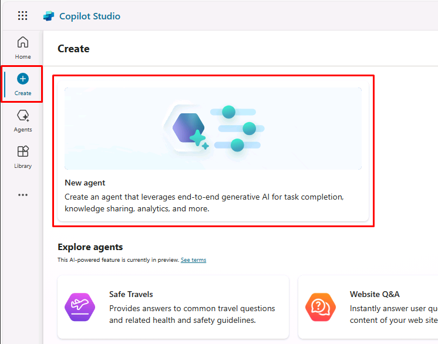
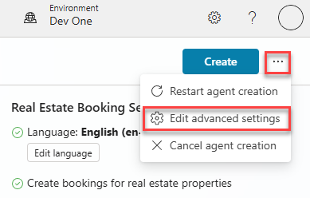
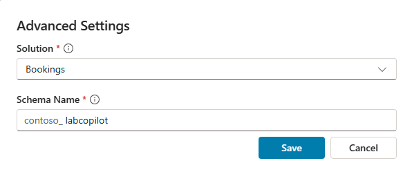
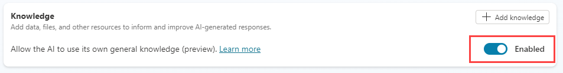
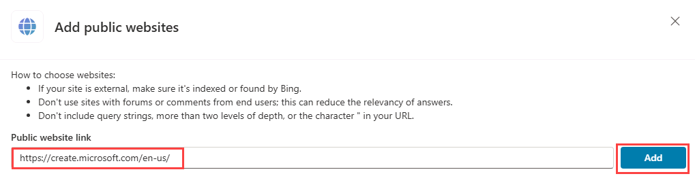
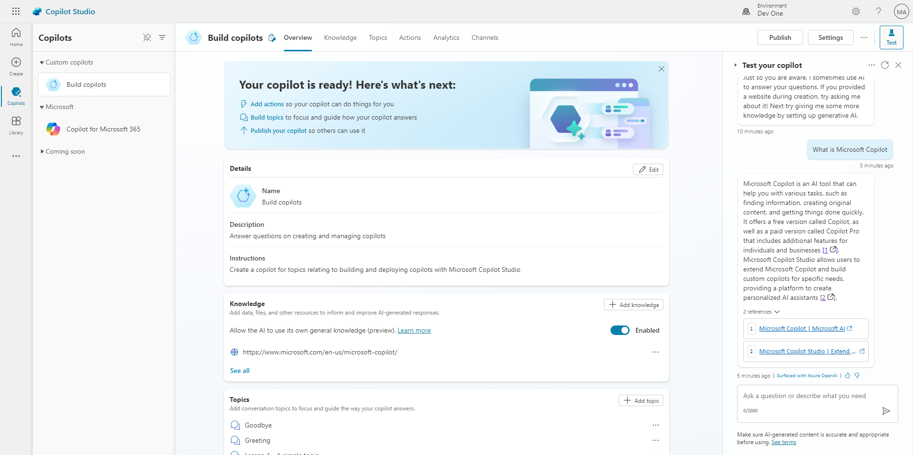

---
lab:
  title: Crear un copiloto inicial
  module: Build an initial copilot with Microsoft Copilot Studio
---

# Crear un copiloto inicial

## Escenario

En este laboratorio, aprenderás a:

- Crear y asignar un nombre a un Copilot
- Agregar una descripción de lo que el Copilot debe hacer
- Configurar respuestas de IA generativa

## Aprendizaje

- Crear un Copilot con lenguaje natural
- Configuración de respuestas de IA generativa para un Copilot

## Pasos de alto nivel del laboratorio

- Crear un copiloto nuevo
- Dile a tu Copilot cuál es su propósito principal y cómo debe actuar
- Agregar instrucciones de IA generativa
  
## Requisitos previos

- Debe haber completado **Laboratorio: Importación de la solución Dataverse**

## Ejercicio 1: Creación de Copilot

En este ejercicio, accederás al portal de Microsoft Copilot Studio, el entorno para desarrolladores y crearás un nuevo Copilot.

### Tarea 1.1: Portal de Microsoft Copilot Studio

1. En una nueva pestaña, ve al portal de Microsoft Copilot Studio `https://copilotstudio.microsoft.com` e inicia sesión con tus credenciales de Microsoft 365 si se te solicita de nuevo.

1. Si se te solicita, selecciona **Iniciar prueba gratuita**.

1. Asegúrate de que estás en el entorno adecuado.

### Tarea 1.2: Crear un Copilot

1. Selecciona **Crear** en el panel de navegación izquierdo y seleccionael icono **Nuevo agente**.

    

1. En el cuadro de texto **Nombre**, escribe **`Real Estate Booking Service`**.

1. En el cuadro de texto **Descripción**, escribe **`Create bookings for real estate properties`**.

1. En el cuadro de texto **Instrucciones**, escribe **`Create a copilot for topics relating to creating bookings for real estate properties`**.

1. En la parte superior, **Idioma** debe establecerse en **Inglés (en-US)**.

    

1. Selecciona los **tres puntos** de la parte superior derecha de la página y selecciona **Editar configuración avanzada**.

    

1. Selecciona **Reservas** en **Solución**.

1. Escribe `labcopilot` en **Nombre del esquema**.

    

1. Seleccione **Guardar**.

1. En la parte superior derecha de la pantalla, selecciona **Crear**.

1. En el panel derecho **Prueba tu agente**, escribe **`How do I make a booking?`**. Visualice la respuesta.

Deja abierta esta ventana.

## Ejercicio 2: Incorporación de respuestas de IA generativa

En este ejercicio, accederás al portal de Microsoft Copilot Studio y agregarás conocimiento que el Copilot usará para responder preguntas mediante IA generativa.

### Tarea 2.1: Habilitar respuestas de IA generativa

1. En la pestaña **Información general**, asegúrate de que **Permitir que la IA use sus propios conocimientos generales** esté establecido en **Habilitado** en la sección **Conocimiento**.

    

### Tarea 2.2: Agregar un origen de conocimiento

1. Selecciona la pestaña **Conocimiento**.

    

1. Selecciona **+ Agregar conocimiento**.

    

1. Selecciona **Sitios web públicos**

1. En el cuadro de texto **Vínculo al sitio web público**, escribe **`https://create.microsoft.com/en-us/`**.

    

1. Seleccione **Agregar**.

1. Seleccione **Agregar**.

1. Seleccione la pestaña **Información general**.

    

1. Selecciona los **tres puntos** en la parte superior del panel **Probar el agente**.

1. Habilita **Seguimiento entre temas**.

    

1. En la parte superior del panel **Probar el agente**, selecciona el icono **Iniciar una nueva conversación** (icono de actualización) junto a la **X**.

    

1. En el cuadro de texto **Escriba su mensaje**, escribe **`How do I boost real estate promotion?`**.

    
