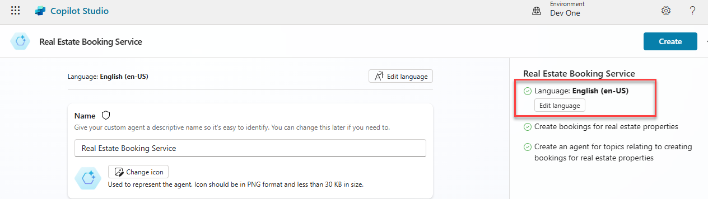
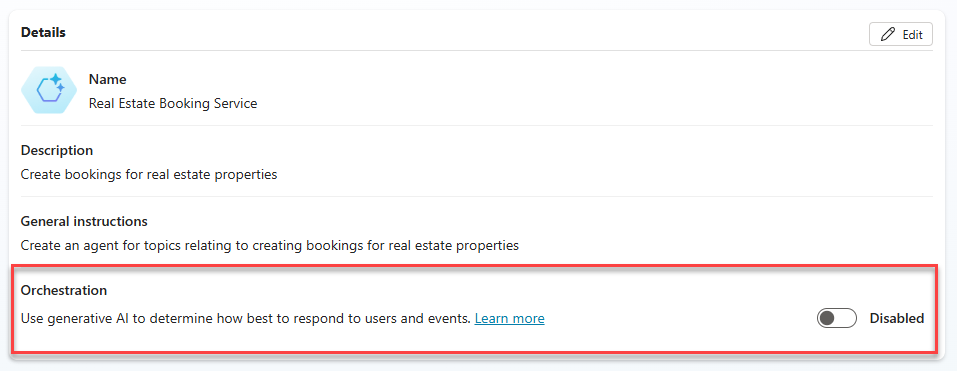

---
lab:
  title: Desarrollo de un agente inicial
  module: Manage topics in Microsoft Copilot Studio
---

# Desarrollo de un agente inicial

## Escenario

En este ejercicio, aprenderás a:

- Crear y asignar un nombre a un agente
- Agregar una descripción de lo que el agente debe hacer
- Configurar respuestas de IA generativa

Este ejercicio tardará aproximadamente **15** minutos en completarse.

## Aprendizaje

- Creación de un agente con lenguaje natural
- Configuración de respuestas de IA generativa para un agente

## Pasos de alto nivel del laboratorio

- Crear un agente nuevo
- Dile al agente cuál es su propósito principal y cómo debe actuar
- Agregar instrucciones de IA generativa
  
## Requisitos previos

- Debes haber completado **Laboratorio: Importación de la solución Dataverse**

## Ejercicio 1: Creación de un agente

En este ejercicio, accederás al portal de Microsoft Copilot Studio, el entorno para desarrolladores y crearás un nuevo agente.

### Tarea 1.1: Portal de Microsoft Copilot Studio

1. En una nueva pestaña, ve al portal de Microsoft Copilot Studio `https://copilotstudio.microsoft.com` e inicia sesión con tus credenciales de Microsoft 365 si se te solicita de nuevo.

1. Si se te solicita, selecciona **Iniciar prueba gratuita**.

1. Asegúrate de que estás en el entorno adecuado.

### Tarea 1.2: Crear un agente

1. Selecciona **Crear** en el panel de navegación izquierdo y selecciona el **+ Nuevo agente** y **Omitir para configurar** en la parte superior derecha.

1. En el cuadro de texto **Nombre**, escribe **`Real Estate Booking Service`**.

1. En el cuadro de texto **Descripción**, escribe **`Create bookings for real estate properties`**.

1. En el cuadro de texto **Instrucciones**, escribe **`Create an agent for topics relating to creating bookings for real estate properties`**.

1. En la parte superior, **Idioma** debe establecerse en **Inglés (en-US)**.

    

1. Selecciona los **tres puntos** de la parte superior derecha de la página y selecciona **Editar configuración avanzada**.

    

1. Selecciona **Reservas** en **Solución**.

1. Escribe `labagent` en **Nombre del esquema**.

    

1. Selecciona **Guardar**.

1. En la parte superior derecha de la pantalla, selecciona **Crear**.

1. En el panel derecho **Prueba tu agente**, escribe **`How do I make a booking?`**. Visualiza la respuesta.

Deja abierta esta ventana.

## Ejercicio 2: Incorporación de respuestas de IA generativa

En este ejercicio, accederás al portal de Microsoft Copilot Studio y agregarás conocimiento que el agente usará para responder preguntas mediante IA generativa.

### Tarea 2.1: Deshabilitar la orquestación generativa

1. En la pestaña **Información general**, asegúrate de **Usar la IA generativa para determinar cómo responder mejor a los usuarios y eventos.** se establece en **Deshabilitado** en la sección **Detalles**.

    

### Tarea 2.2: Habilitar respuestas de IA generativa

1. En la pestaña **Información general**, asegúrate de que **Permitir que la IA use sus propios conocimientos generales** esté establecido en **Habilitado** en la sección **Conocimiento**.

    

### Tarea 2.3: Agregar un origen de conocimiento

1. Selecciona la pestaña **Conocimiento**.

    

1. Selecciona **+ Agregar conocimiento**.

1. Selecciona **Sitios web públicos**

1. En el cuadro de texto **Vínculo al sitio web público**, escribe **`https://create.microsoft.com/en-us/`**.

    

1. Selecciona **Agregar**.

1. Selecciona **Agregar**.

1. Selecciona la pestaña **Información general**.

1. Selecciona los **tres puntos** en la parte superior del panel **Probar el agente**.

1. Habilita **Seguimiento entre temas**.

    

1. En la parte superior del panel **Probar el agente**, selecciona el icono **Iniciar una nueva conversación** (icono de actualización).

    

1. En el cuadro de texto **Formular preguntas o describir lo que necesita**, escribe **`How do I boost real estate promotion?`**.

    
