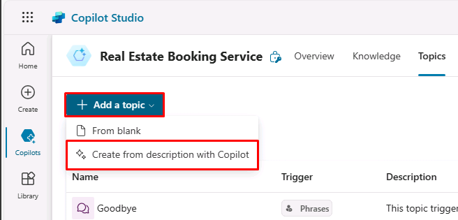
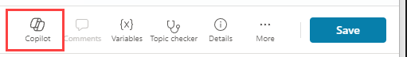
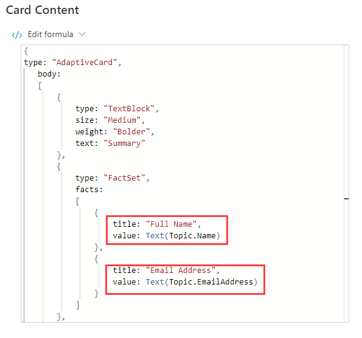
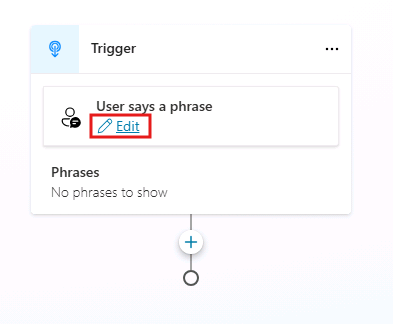

---
lab:
  title: Administrar temas
  module: Manage topics in Microsoft Copilot Studio
---

# Administrar temas

## Escenario

En este laboratorio, aprenderás a:

- Administrar los tokens existentes
- Crear y editar temas mediante lenguaje natural
- Crear un tema manualmente mediante frases desencadenadoras

## Aprendizaje

- Configuración de temas del agente

## Pasos de alto nivel del laboratorio

- Eliminar los temas de ejemplo
- Deshabilitar temas
- Crear y editar temas nuevos con lenguaje natural
- Crear un nuevo tema y agregar frases desencadenadoras
  
## Requisitos previos

- Debes haber completado **Laboratorio: Compilación de un agente inicial**

## Pasos detallados

## Ejercicio 1: Eliminación de temas

En este ejercicio, quitarás los temas de un agente.

### Tarea 1.1: Deshabilitar temas

1. Ve al portal `https://copilotstudio.microsoft.com` de Microsoft Copilot Studio y asegúrate de que estás en el entorno adecuado.

1. Selecciona el botón **Probar** en la parte superior derecha de la pantalla para cerrar el panel de pruebas si el panel está abierto.

1. Selecciona **Agentes** en el panel de navegación de la izquierda.

    

1. Selecciona el agente que has creado en el laboratorio anterior.

1. Selecciona la pestaña **Temas**.

    

1. Alterna de **Habilitado** a **Apagado** en el tema **Volver a empezar**.

    

## Ejercicio 2: Creación de temas con lenguaje natural

En este ejercicio, crearás temas en un agente y agregarás frases desencadenadoras.

### Tarea 2.1: Agregar un tema mediante Copilot

1. Selecciona **+ Agregar un tema** y selecciona **Crear a partir de la descripción con Copilot**. Aparece una nueva ventana.

    

    

1. En el cuadro de texto **Name your topic**, escribe **`Customer Details`**.

1. En el cuadro de texto **Crear un tema para...**, escribe **`Ask the customer for their name and email address.`**

1. Selecciona **Crear**.

1. Selecciona **Guardar**.

### Tarea 2.2: Actualizar nodos con lenguaje natural

1. Si el panel **Editar con CoPilot** no se muestra a la derecha del panel **Detalles del cliente**, selecciona el icono **Copilot** en la parte superior del lienzo de creación.

    

1. Selecciona el segundo nodo **Pregunta**, **¿Cuál es su dirección de correo electrónico?**

    

1. En el panel **Editar con Copilot**, en el campo **¿Qué desea hacer?**, escribe el texto siguiente:

    `Replace "What is your email address?" to say thank you to the Name variable from the previous node and then proceed to ask the email address question.`

1. Selecciona **Actualizar**.

    

    

    > **Nota**: el mensaje debe actualizarse para incluir la variable *Nombre* del nodo anterior, y debe ser similar a la captura de pantalla anterior.

1. Seleccione **Guardar**.

### Tarea 2.3: Agregar nodos con lenguaje natural

Además de agregar y actualizar nodos existentes, puedes usar Copilot para agregar otros nuevos.

1. Asegúrese de que no haya ningún nodo seleccionado al hacer clic en el espacio vacío alrededor de los nodos.

1. En el panel **Editar con Copilot**, en el campo **¿Qué desea hacer?**, escribe el texto siguiente:

    `Summarize the information collected in an adaptive card`

1. Seleccione **Actualizar**.

1. Se agrega un nodo de mensajes con una tarjeta adaptable al final del tema.

    

1. Selecciona el cuadro **Multimedia** de la tarjeta adaptable. Las propiedades de la tarjeta adaptable deberían aparecer a la derecha de la pantalla.

    

   La fórmula de su tarjeta adaptable debería ser similar a la anterior. Si no es así, puedes pegar la siguiente fórmula:

    ```json
    {
    type: "AdaptiveCard", 
        body: 
        [
            {
                type: "TextBlock",
                size: "Medium",
                weight: "Bolder",
                text: "Summary"    
            },
            {
                type: "FactSet",
                facts: 
                [
                    {
                        title: "Full Name",
                        value: Text(Topic.Name)
                    },
                    {
                        title: "Email Address",
                        value: Text(Topic.EmailAddress)
                    }
                ]
            },
            {
                type: "TextBlock",
                text: "Thank you for providing the information."
            }
        ]
    }
    ```

1. Al abrir las propiedades de la tarjeta adaptable se cierra el panel **Editar con Copilot**; por lo tanto, debes seleccionar el icono **Copilot** para volver a abrirlo.

1. Asegúrese de que no haya ningún nodo seleccionado al hacer clic en el espacio vacío alrededor de los nodos.

1. En el campo **¿Qué desea hacer?**, escriba el texto siguiente:

    `Add a new multiple choice question to prompt the user if the details are correct with two options Yes or No`

1. Seleccione **Actualizar**.

1. Se agrega un nuevo nodo de pregunta al final del tema con opciones para que el usuario las seleccione.

    

1. Seleccione **Guardar**.

### Tarea 2.4: Probar el tema

1. Selecciona el botón **Probar** en la parte superior derecha de la pantalla para abrir el panel de pruebas, si está cerrado.

1. Selecciona el icono **Iniciar una nueva conversación** en la parte superior del panel de pruebas.

1. En el cuadro de texto **Formular preguntas o describir lo que necesita**, escribe **`Customer information`**.

1. Introduzca su nombre y dirección de correo electrónico.

1. Seleccione **Sí**.

## Ejercicio 3: Creación manual de temas

Los temas se pueden crear manualmente agregando frases desencadenadoras.

### Tarea 3.1: Crear un tema desde cero

1. Selecciona la pestaña **Temas** de la barra superior de **Servicio de reservas inmobiliarias**.

1. Selecciona **+ Agregar un tema** y elige **Desde cero**.

1. Selecciona el icono **Detalles** para abrir el diálogo Detalles del tema.

    

1. En el campo **Nombre**, escribe el siguiente texto:

    `Book a Real Estate Showing`

1. En el campo **Nombre para mostrar**, escribe el siguiente texto:

    `Book`

1. En el campo **Descripción**, escribe el siguiente texto:

    `Select the property and requested date and create a booking request`

1. Seleccione **Guardar**.

### Tarea 3.2: Agregar frases desencadenadoras

1. Selecciona **Editar** en **Frases** del **desencadenador**.

    

1. Escribe `I want to book a real estate showing` en **Agregar frases** y selecciona el icono **+**.

1. Escribe `Schedule a real estate showing` en **Agregar frases** y selecciona el icono **+**.

1. Escribe `Arrange the viewing for a real estate property` en **Agregar frases** y selecciona el icono **+**.

1. Escribe `Set up an appointment to view a house` en **Agregar frases** y selecciona el icono **+**.

1. Escribe `Plan a property viewing` en **Agregar frases** y selecciona el icono **+**.

1. Seleccione **Guardar**.
