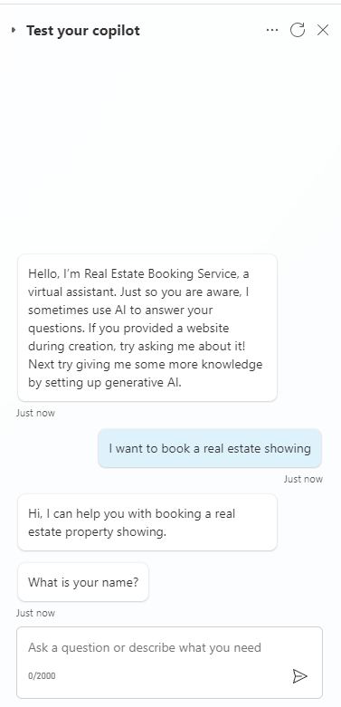

---
lab:
  title: Administración de nodos
  module: Manage topics in Microsoft Copilot Studio
---

# Administración de nodos

## Escenario

En este ejercicio, aprenderás a:

- Crear el flujo conversacional
- Administración de variables

Este ejercicio tardará aproximadamente **30** minutos en completarse.

## Aprendizaje

- Adición de nodos a un tema para crear el flujo conversacional

## Pasos de alto nivel del laboratorio

- Configuración del ámbito de las variables
- Creación y edición de nodos
- Implementación y prueba del agente
  
## Requisitos previos

- Debes haber completado el **Laboratorio: Administrar temas**

## Pasos detallados

## Ejercicio 1: Ámbito de las variables

Otros temas pueden acceder a las variables.

### Tarea 1.1: Configurar el ámbito de las variables

1. Ve al portal de Microsoft Studio `https://copilotstudio.microsoft.com` y asegúrate de que estás en el entorno adecuado.

1. Selecciona el botón **Probar** en la parte superior derecha de la pantalla para cerrar el panel de pruebas si el panel está abierto.

1. Selecciona **Agentes** en el panel de navegación de la izquierda.

1. Selecciona el agente que has creado en el laboratorio anterior.

1. Selecciona la pestaña **Temas**.

1. Selecciona el tema **Detalles del cliente**.

1. Selecciona **Variables** en la barra superior para abrir el panel Variables.

1. Activa las casillas de la derecha para las tres variables de tema.

    

1. Selecciona **Guardar**.

## Ejercicio 2: Creación manual de temas

El flujo conversacional de un tema se puede crear manualmente al agregar nodos.

### Tarea 2.1: Agregar un nodo de mensaje

1. Selecciona la pestaña **Temas**.

1. Selecciona el tema **Reservar una presentación inmobiliaria**.

1. Selecciona el icono **+** del nodo Desencadenador y selecciona **Enviar un mensaje**.

    

1. En el campo **Escribe un mensaje**, escribe el siguiente texto:

    `Hi, I can help you with booking a real estate property showing.`

1. Selecciona **Guardar**.

### Tarea 2.2: Agregar un nodo de administración de temas

1. Selecciona el icono **+** del nodo **Mensaje**, **Administración de temas**, después **Ir a otro tema** y luego selecciona **Detalles del cliente**.

    

1. Selecciona **Guardar**.

### Tarea 2.3: Agregar condición de nodo

1. Selecciona el icono **+** bajo el nodo **Redireccionamiento** y selecciona **Agregar una condición**.

1. En el nodo **Condición**, selecciona la variable **DetailsCorrect**.

1. Selecciona **es igual a**.

1. Selecciona **Sí**.

    

1. Selecciona **Guardar**.

### Tarea 2.4: Agregar nodos de preguntas

1. Selecciona el icono **+** del nodo de la izquierda **Condición** y selecciona **Hacer una pregunta**.

1. En el campo **Escribe un mensaje**, escribe el siguiente texto:

    `Which property do you want to see?`

1. Selecciona **Respuesta completa del usuario** en **Identificar**.

1. Selecciona la variable en **Guardar respuesta del usuario como** y escribe **`PropertyName`** en **Nombre de variable**.

    

1. Selecciona **Guardar**.

1. Selecciona el icono **+** situado debajo del nuevo nodo **Pregunta** y selecciona **Hacer una pregunta**.

1. En el campo **Escribe un mensaje**, escribe el siguiente texto:

    `What date and time do you want to see the property?`

1. Selecciona **Fecha y hora** en **Identificar**.

1. Selecciona la variable en **Guardar respuesta del usuario como** y escribe **`DateTime`** en **Nombre de variable**

1. Selecciona **Guardar**.

### Tarea 2.5: Probar el agente

1. Si no está abierto, selecciona el botón **Prueba** en la parte superior derecha de la pantalla para abrir el panel de pruebas.

1. Selecciona los **tres puntos** en la parte superior del panel de pruebas en la parte superior derecha de la pantalla.

1. Si no está habilitado, habilita **Realizar seguimiento de un tema a otro**.

    

1. Selecciona el icono **Iniciar una nueva conversación** en la parte superior del panel de pruebas.

1. Cuando aparezca el mensaje **Inicio de conversación**, el agente iniciará una conversación. Como respuesta, introduce una frase desencadenadora para el tema que has creado:

    `I want to book a real estate showing`

1. El agente responde con la pregunta "¿Cómo te llamas?" , como se muestra en la siguiente imagen.

    

1. Introduzca su nombre y dirección de correo electrónico.

1. Después de proporcionar la información, una tarjeta adaptable muestra la información que has escrito y pregunta si los detalles son correctos. Seleccione **Sí**.

1. Escribe `555 Oak Lane, Denver, CO 80203` en la indicación **¿Qué propiedad desea ver?**.

1. Escribe `Tomorrow 10:00 AM` en la indicación **¿En qué fecha y hora desea ver la propiedad?**.

    

## Ejercicio 3: Implementación del agente

### Tarea 3.1: Configurar la autenticación

1. Selecciona **Configuración** en la parte superior derecha de **Servicio de reservas inmobiliarias**.

1. Selecciona la pestaña **Seguridad**.

1. Selecciona el icono **Autenticación**.

    

1. Seleccione **Sin autenticación**.

1. Selecciona **Guardar**.

1. Selecciona **Guardar** en la ventana de confirmación.

1. Selecciona la **X** en la parte superior derecha para cerrar la **Configuración**.

### Tarea 3.2: Publicar el agente

1. Selecciona **Publicar** en la parte superior derecha y después vuelve a seleccionar **Publicar**.

### Tarea 3.3: Sitio web de demostración

1. Selecciona los **tres puntos** junto al botón **Configuración** en la parte superior derecha de la pantalla y selecciona **Ir al sitio web de demostración**.

1. En el cuadro de texto **Escribir tu mensaje**, escribe **`I want to book a property`**.

1. Responde a las indicaciones para probar el agente.
