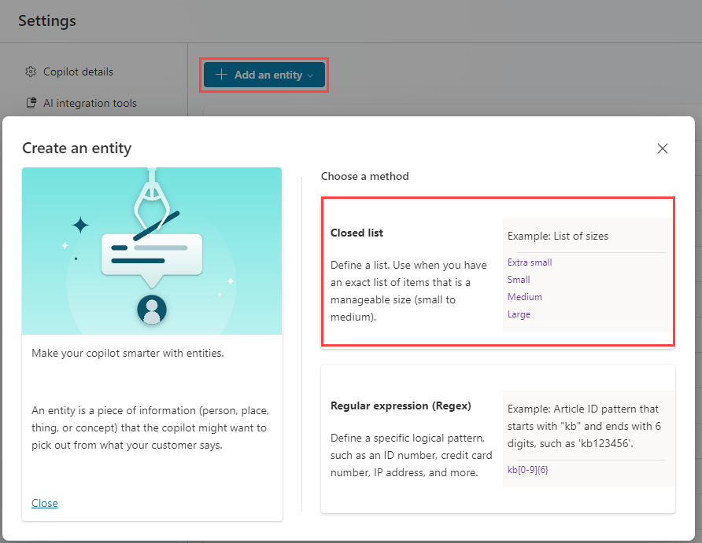
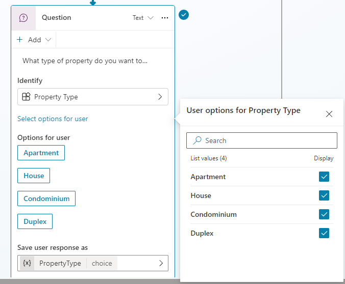

---
lab:
  title: Trabajar con entidades
  module: Work with entities and variables in Microsoft Copilot Studio
---

# Trabajar con entidades

## Escenario

En este laboratorio, aprenderás a:

- Creación y uso de entidades

## Aprendizaje

- Cómo crear y usar entidades para mejorar el copiloto

## Pasos de alto nivel del laboratorio

- Crear entidades
- Usar entidades en nodos
  
## Requisitos previos

- Debes haber completado el **Laboratorio: Administrar nodos**

## Pasos detallados

## Ejercicio 1: Creación de entidades

Microsoft Copilot Studio usa entidades para comprender la intención del usuario. Hay muchas entidades precompiladas incluidas para la información usada habitualmente. Puedes crear entidades personalizadas para tu propósito específico.

### Tarea 1.1: Visualización de entidades precompiladas

1. Ve al portal `https://copilotstudio.microsoft.com` de Microsoft Copilot Studio y asegúrate de que estás en el entorno adecuado.

1. Selecciona **Copilotos** en el panel de navegación izquierdo.

1. Selecciona el **servicio de reserva inmobiliaria** que creaste en el laboratorio anterior.

1. Selecciona **Configuración** en la parte superior derecha de la pantalla.

1. Selecciona la pestaña **Entidades**.

    

### Tarea 1.2: Creación de la entidad de tipo de propiedad

1. Selecciona **+ Agregar una entidad** y selecciona **+ Nueva entidad**.

    

1. Selecciona el título **Lista cerrada**.

1. Escribe **`Property Type`** en el campo **Nombre**.

1. Escribe **`Apartment`** en el campo **Introducir elemento** y selecciona **Agregar**.

1. Escribe **`Condominium`** en el campo **Introducir elemento** y selecciona **Agregar**.

1. Escribe **`Duplex`** en el campo **Introducir elemento** y selecciona **Agregar**.

1. Escribe **`House`** en el campo **Introducir elemento** y selecciona **Agregar**.

1. Selecciona **+ Sinónimos** para **Apartmento**, escribe **`Flat`**, selecciona el icono **+** y selecciona **Listo**.

1. Selecciona **+ Sinónimos** para **Condominio**, escribe **`Townhouse`**, selecciona el icono **+** y selecciona **Listo**.

1. Selecciona **+ Sinónimos** para **Casa**, escribe **`Single-family home`**, selecciona el icono **+** y selecciona **Listo**.

    

1. Seleccione **Guardar**.

1. Seleccione **Cerrar**.

### Tarea 1.3: Creación de la entidad número de dormitorios

1. Selecciona **+ Agregar una entidad** y selecciona **+ Nueva entidad**.

1. Selecciona el icono **Expresión regular (Regex)**.

1. Escribe **`Number of Bedrooms`** en el campo **Nombre**.

1. Escribe **`[1-5]`** en el campo **Patrón**.

1. Seleccione **Guardar**.

1. Seleccione **Cerrar**.

## Ejercicio 2: Uso de entidades para mejorar el copiloto

Usa entidades en el flujo conversacional para mejorar el copiloto.

### Tarea 2.1: Uso de entidades

1. Selecciona el icono **X** de la parte superior derecha para cerrar la Configuración y volver a tu copiloto.

1. Selecciona la pestaña **Temas**.

1. Selecciona el tema **Reservar una presentación inmobiliaria**.

1. Selecciona el icono **+** entre los nodos **Condición** y **Pregunta** de propiedad y, a continuación, selecciona **Hacer una pregunta**.

1. En el campo **Escribe un mensaje**, escribe el siguiente texto:

    `What type of property do you want to see?`

1. Selecciona **Tipo de propiedad** para **Identificar**.

1. Selecciona **Seleccionar opciones para el usuario** y activa la opción **Mostrar** para los cuatro valores.

1. Selecciona la variable en **Guardar respuesta del usuario como** y escribe **`PropertyType`** para **Nombre de variable**

    

1. Selecciona el icono **+** situado debajo del nuevo nodo **Pregunta** y selecciona **Hacer una pregunta**.

1. En el campo **Escribe un mensaje**, escribe el siguiente texto:

    `How many bedrooms do you need?`

1. Selecciona **Número de dormitorios** para **Identificar**.

1. Selecciona la variable en **Guardar respuesta del usuario como** y escribe **`NumberofBedrooms`** para **Nombre de variable**

1. Seleccione **Guardar**.
