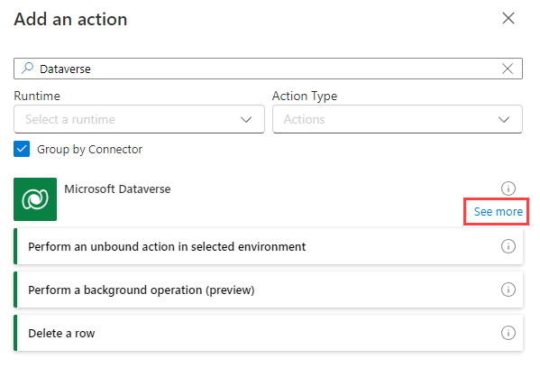
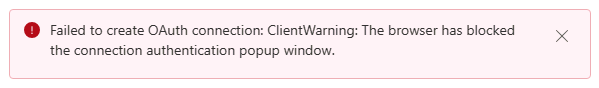
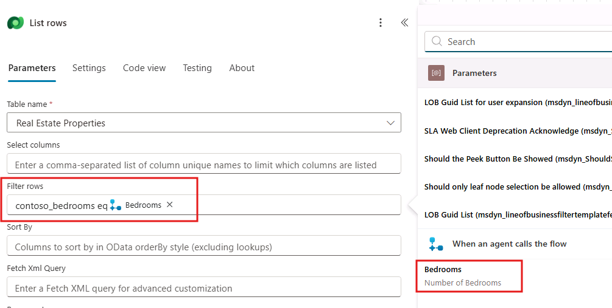
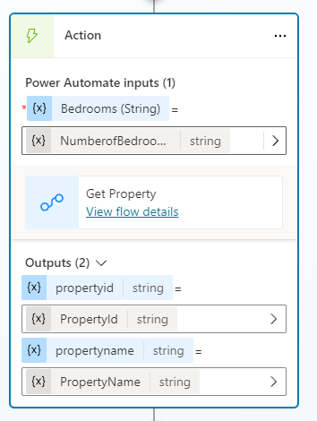
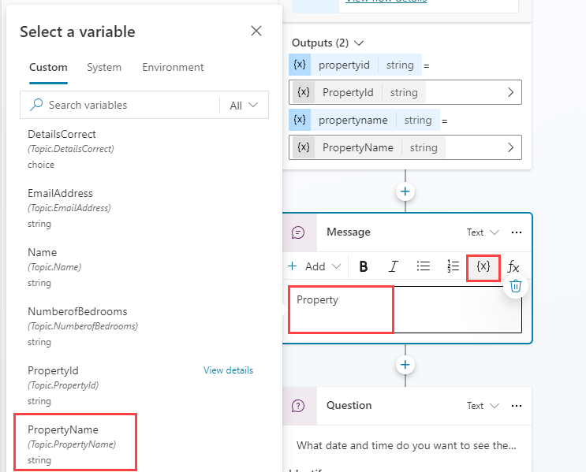

---
lab:
  title: Creación de flujos de agente
  module: Enhance Microsoft Copilot Studio agents
---

# Creación de flujos de agente

## Escenario

En este ejercicio, aprenderás a:

- Creación de un flujo de agente

Este ejercicio tardará aproximadamente **30** minutos en completarse.

## Aprendizaje

- Creación de una herramienta para ejecutar un flujo de agente en Copilot Studio

## Pasos de alto nivel del laboratorio

- Creación de un flujo de agente para recuperar datos de Dataverse
- Creación de un flujo de agente para crear datos de Dataverse
  
## Requisitos previos

- Debes haber completado el **Laboratorio: Trabajar con entidades**

## Pasos detallados

## Ejercicio 1: Creación de una herramienta para recuperar datos de Dataverse

Microsoft Copilot Studio puede acceder a los datos de Microsoft Dataverse mediante flujos de agente.

### Tarea 1.1: Creación de un flujo de agente para recuperar una propiedad

1. Ve al portal `https://copilotstudio.microsoft.com` de Microsoft Copilot Studio y asegúrate de que estás en el entorno adecuado.

1. Selecciona **Agentes** en el panel de navegación de la izquierda.

1. Selecciona el **servicio de reserva inmobiliaria** que creaste en el laboratorio anterior.

1. Seleccione la pestaña **Herramientas**.

1. Seleccione **+ Agregar una herramienta**.

1. Seleccione **+ Nueva herramienta**.

1. Seleccione **Flujo del agente**.

1. Selecciona el paso del desencadenador **Cuando un agente llama al flujo** y selecciona **+ Agregar una entrada**.

1. Selecciona **Texto**.

1. Escribe `Bedrooms` en **Entrada** y `Number of Bedrooms` para **Escribe la entrada**.

    

1. Selecciona el icono **+** entre los dos pasos del flujo para agregar una nueva acción.

1. Escribe `Dataverse` en el campo **Buscar** y selecciona **Ver más** para el conector de **Microsoft Dataverse**.

    

1. Selecciona la acción **Listar filas**.

1. Si se le solicita autenticación, escriba `Lab connection` para **Nombre de conexión**, seleccione **OAuth** para **Tipo de autenticación y seleccione **Iniciar sesión**.

    > **Nota:** si ves un error "**No se pudo crear la conexión de OAuth**", es posible que tengas que permitir elementos emergentes en tu explorador.

    

    

1. Selecciona **Propiedades inmobiliarias** para nombre de tabla.

1. Escribe `contoso_bedrooms eq ` (con un espacio después de **eq**) en el campo **Filtrar filas**.

1. Con el campo **Filtrar filas** aún seleccionado, selecciona el icono de **rayo** a su derecha y, a continuación, selecciona el parámetro **Bedrooms**.

    

    > **Importante:** Asegúrate de que hay un espacio entre eq y Bedrooms.

1. Seleccione la acción **Responder a Copilot** en el lienzo de creación y seleccione **+ Agregar una salida**.

1. Selecciona **Texto**.

1. Escribe `PropertyId` para **Escriba un nombre**

1. Selecciona el campo **Escribir un valor con el que responder** y selecciona **fx (Insertar expresión)**.

1. Escribe la siguiente expresión en el campo superior:

    ```
    first(outputs('List_rows')?['body/value'])['contoso_realestatepropertyid']
    ```

1. Seleccione **Agregar**.

1. Selecciona **+Agregar una salida**.

1. Selecciona **Texto**.

1. Escribe `PropertyName` para **Escriba un nombre**.

1. Selecciona el campo **Escribir un valor con el que responder** y selecciona **fx (Insertar expresión)**.

1. Escriba la siguiente expresión:

    ```
    first(outputs('List_rows')?['body/value'])['contoso_propertyname']
    ```
    

1. Seleccione **Agregar**.

1. Selecciona la pestaña **Configuración** en el panel **Responder a Copilot**.

1. Asegúrate de que **Respuesta asincrónica** esté establecida en **Desactivado**.

    

1. Selecciona **Guardar borrador** junto a la parte superior derecha de la página.

1. Espere a que se complete el guardado y seleccione **Publicar**. En el **Flujo del agente se publicó correctamente.** emergente, seleccione **Volver al agente**.

1. Selecciona la pestaña **Información general**.

1. Seleccione **Editar** en la sección **Detalles**. 

1. Actualice el **Nombre de flujo** a `Get Property`

1. Seleccione **Guardar**.

1. Seleccione **Agentes** y elija su **Servicio de reservas inmobiliarias**. 

1. Seleccione **Herramientas** y vea el flujo Obtener propiedad que ha creado.


### Tarea 1.2: Adición de la herramienta Obtener agente de propiedad al tema

1. Selecciona la pestaña **Temas**.

1. Selecciona el tema **Reservar una presentación inmobiliaria**.

1. Seleccione el icono **+** situado debajo del nodo **¿Cuántos dormitorios necesita?**, seleccione **Agregar una herramienta** y, a continuación, seleccione el flujo **Obtener propiedad**.

1. Selecciona la variable **NumberofBedrooms** para el parámetro de entrada **Bedrooms**.

    

1. Selecciona los **tres puntos** en el nodo de pregunta **¿Qué propiedad desea ver?** y selecciona **Eliminar**.

1. Selecciona el icono **+** en el nodo **Acción** y selecciona **Enviar un mensaje**.

1. En el campo **Escribir un mensaje**, escribe `Property ` (con un espacio después).

1. En el mismo nodo, selecciona el icono **{X} (Insertar variable)** y selecciona la variable **PropertyName**.

    

1. Seleccione **Guardar**.

## Ejercicio 2: Creación de una herramienta para crear datos en Dataverse

Microsoft Copilot Studio puede crear los datos de Microsoft Dataverse mediante flujos de agente.

### Tarea 2.1: Creación de un flujo de agente para realizar una reserva

1. Seleccione la pestaña **herramientas** en **Servicio de reservas inmobiliarias**.

1. Seleccione **+ Agregar una herramienta**.

1. Seleccione **+ Nueva herramienta** y, después, **Flujo del agente**.

1. Seleccione **Guardar borrador** y espere a que se guarde el flujo del agente.

1. Haga clic en la pestaña **Información general**.

1. Seleccione **Editar** en la sección **Detalles**. 

1. Renombrar el flujo `Create Booking Request`

1. Seleccione **Guardar**.

1. Seleccione la pestaña **Diseñador**.

1. Selecciona el paso del desencadenador **Cuando un agente llama al flujo** y selecciona **+ Agregar una entrada**.

1. Selecciona **Texto**.

1. Escribe `PropertyId` en **Entrada** y `Property` para **Escriba su entrada**.

1. Selecciona **+ Agregar una entrada**.

1. Selecciona **Texto**.

1. Escribe `ViewerName` para **Entrada** y `Viewer Name` en **Escriba su entrada**.

1. Selecciona **+ Agregar una entrada**.

1. Selecciona **Texto**.

1. Escribe `ViewerEmail` para **Entrada** y `Viewer Email` para **Escriba su entrada**.

    

1. Selecciona el icono **+** entre los dos pasos del flujo para agregar una nueva acción.

1. Escribe `Dataverse` en el campo **Buscar** y selecciona **Ver más** para el conector de **Microsoft Dataverse**.

1. Selecciona la acción **Agregar una nueva fila**.

1. Selecciona **Solicitudes de reserva** para el nombre de tabla.

1. Escribe `Agent booking` en el campo **Nombre de reserva**.

1. Selecciona **Mostrar todo** en **Parámetros avanzados**.

1. Escribe `contoso_bookingrequests()` en el campo **Propiedad (Propiedades inmobiliarias)**, mueve el cursor dentro del paréntesis, selecciona el icono de **rayo** y, a continuación, selecciona el parámetro **PropertyId**.

1. Selecciona el campo **Correo electrónico del visor**, selecciona el icono de **rayo** y, a continuación, selecciona el parámetro **ViewerEmail**.

1. Selecciona el campo **Nombre del visor**, selecciona el icono de **rayo** y, a continuación, selecciona el parámetro **ViewerName**.

    

1. Selecciona la acción **Responder a Copilot**.

1. Selecciona la pestaña **Configuración**.

1. Asegúrate de que **Respuesta asincrónica** esté establecida en **Desactivado**.

1. Selecciona **Guardar borrador** en la parte superior derecha de la ventana.

1. Espere a que se complete el guardado y seleccione **Publicar**.

1. Seleccione la pestaña **Información general**.

1. Seleccione **Editar** en la sección Detalles.

1. Cambie el nombre del flujo del agente `Create Booking Request`

1. Seleccione **Guardar**.

### Tarea 2.2: Validación de las herramientas

1. Seleccione **Agentes** y abra el agente de **Servicio de reservas inmobiliarias**.

1. Seleccione la pestaña **Herramientas** y compruebe que ambos flujos de agente están en la lista. Si no es así, seleccione **+Agregar una herramienta** > **Flujo** > y seleccione el flujo del agente que falta. Seleccione **Agregar al agente**.

### Tarea 2.3: Adición de la herramienta Crear solicitud de reserva al tema

1. Selecciona la pestaña **Temas**.

1. Selecciona el tema **Reservar una presentación inmobiliaria**.

1. Seleccione el icono **+** situado debajo del nodo **¿Qué fecha y hora desea ver la propiedad?**, seleccione **Agregar una herramienta** y, a continuación, seleccione el flujo **Crear solicitud de reserva**.

1. Selecciona la variable **PropertyId** para el parámetro de entrada **PropertyId**.

1. Selecciona la variable **Name** para el parámetro de entrada **ViewerName**.

1. Selecciona la variable **EmailAddress** para el parámetro de entrada **ViewerEmail**.

1. Selecciona el icono **+** situado debajo del nuevo nodo **Acción**, selecciona **Administración de temas**, selecciona **Ir a otro tema** y selecciona **Finalizar conversación**.

1. Selecciona **Guardar**.

1. Selecciona **Publicar** y vuelve a seleccionar **Publicar**.

## Ejercicio 3: Prueba del agente

### Tarea 3.1: Realizar una solicitud de reserva

1. Selecciona el botón **Probar** en la parte superior derecha de la pantalla para abrir el panel de pruebas.

1. Selecciona los **tres puntos** en la parte superior del panel de pruebas en la parte superior derecha de la pantalla.

    

1. Si no está habilitado, habilita **Realizar seguimiento de un tema a otro**.

1. Seleccione el icono **Iniciar una nueva conversación** (actualizar) en la parte superior del panel de pruebas.

1. Cuando aparezca el mensaje **Inicio de conversación**, el agente iniciará una conversación. Como respuesta, introduce una frase desencadenadora para el tema que ha creado:

    `I want to book a real estate showing`

1. Escribe la siguiente información:

    ```
    Name: <Your name>
    ```
    ```
    Email address: <Your email address>
    ```

1. Después de proporcionar la información, una tarjeta adaptable muestra la información que has escrito y pregunta si los detalles son correctos. Selecciona **Sí**.

1. Selecciona **Casa** para el tipo de solicitud de propiedad.

1. Escribe `3` para el número de solicitudes de dormitorios.

    

1. Escribe `Tomorrow 2:00 PM` en la indicación **¿En qué fecha y hora desea ver la propiedad?**.

1. Selecciona **Sí** en la indicación **¿Ha respondido a la pregunta?**.

1. Selecciona cualquier clasificación.

1. Escribe **No** para el mensaje **¿Puedo ayudar con cualquier otra cosa?**.

### Tarea 3.2: Comprobar la solicitud de reserva

1. Si aún no está abierta, ve a `https://make.powerapps.com` en una nueva pestaña.

1. Asegúrate de que estás en el entorno adecuado.

1. Seleccione **Aplicaciones** en el menú de navegación izquierdo.

1. Selecciona **Reproducir** en la aplicación basada en modelo **Administración de propiedades inmobiliarias**.

1. En la navegación de la izquierda, selecciona **Solicitudes de reserva**. Vea la solicitud de reserva que acaba de crear el agente.

    
