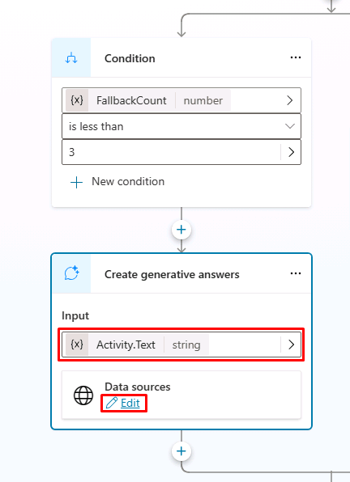

---
lab:
  title: Uso de la IA generativa en Microsoft Copilot Studio
  module: Enhance Microsoft Copilot Studio copilots
---

# Uso de la IA generativa en Microsoft Copilot Studio

## Escenario

En este laboratorio, aprenderás a:

- Crear acciones de agente

## Aprendizaje

- Cómo usar la característica de respuestas generativas para mejorar las respuestas de agente.

## Pasos de alto nivel del laboratorio

- Habilitación de la IA generativa
- Agregar conocimiento
  
## Requisitos previos

- Debes haber completado **Laboratorio: Creación de acciones del agente**

## Pasos detallados

## Ejercicio 1: Configuración de IA generativa

### Tarea 1.1: Habilitar la IA generativa

1. Si aún no está abierto, ve al portal de Microsoft Copilot Studio `https://copilotstudio.microsoft.com` y asegúrate de que estás en el entorno adecuado.

1. Selecciona **Agentes** en el panel de navegación de la izquierda.

1. Selecciona el **servicio de reserva inmobiliaria** que creaste en el laboratorio anterior.

1. Selecciona el botón **Configuración** en la parte superior derecha de la pantalla.

1. Selecciona la pestaña **AI generativa**.

1. Selecciona **Generativo** en **¿Cómo debe interactuar tu agente con la gente?**.

1. Selecciona **Media: más equilibrada** para **¿Cómo de estricta debe ser la moderación de contenido?**.

1. Selecciona **Guardar**.

    

1. Cierra el menú **Configuración** al seleccionar el icono **X** en la parte superior derecha de Copilot Studio.

### Tarea 1.2: Usar respuestas generativas en el tema de refuerzo conversacional

1. Selecciona la pestaña **Temas** y selecciona el filtro **Sistema**.

1. Selecciona el tema **Refuerzo conversacional**.

    

1. Revisa el nodo **Creación de respuestas generativas**.

### Tarea 1.3: Habilitar el conocimiento

1. Selecciona la pestaña **Información general**.

1. Comprueba que el conocimiento general está **habilitado**.

    

1. Deberías ver que el sitio web público se ha agregado como conocimiento en un laboratorio anterior.

### Tarea 1.4: Configurar la autenticación

1. Selecciona **Configuración** en la parte superior derecha de la pantalla.

1. Selecciona la pestaña **Seguridad**.

1. Selecciona el icono **Autenticación**.

1. Selecciona **Autenticar con Microsoft**.

1. Selecciona **Guardar**.

1. Selecciona **Guardar**.

1. Cierra el menú **Configuración** al seleccionar la **X** en la parte superior derecha de Copilot Studio.

1. Selecciona **Publicar** y vuelve a seleccionar **Publicar**.

## Ejercicio 2: Incorporación de conocimiento

### Tarea 2.1: Incorporar conocimiento de Dataverse

1. Selecciona la pestaña **Conocimiento**.

1. Selecciona **+ Agregar conocimiento**.

1. Selecciona **Dataverse**.

1. Selecciona la tabla **Propiedad inmobiliaria**.

    

1. Selecciona **Siguiente**.

1. Selecciona **Siguiente**.

1. Selecciona **Agregar**.

### Tarea 2.2: Agregar conocimientos a partir de archivos

1. Descarga este [**Caso práctico de Microsoft**](https://download.microsoft.com/documents/customerevidence/Files/4000007499/SummitRealtyCaseStudy.docx) o [**SummitRealtyCaseStudy.docx**](../../Allfiles/SummitRealtyCaseStudy.docx) de GitHub.

1. Selecciona **+ Agregar conocimiento**.

1. Seleccione **Archivos**.

1. En **Cargar archivos**, busca y selecciona el caso práctico que has descargado.

    

1. Selecciona **Agregar**.

    

## Ejercicio 3: Configuración del tema alternativo

### Tarea 3.1: Usar respuestas generativas en el tema alternativo del sistema

1. Selecciona la pestaña **Temas** y selecciona el filtro **Sistema**.

1. Selecciona el tema **Alternativo**.

    

1. Selecciona los **tres puntos** del nodo **Mensaje** y selecciona **Eliminar**.

1. Selecciona el icono **+** del nodo **Condición**, elige **Avanzado** y selecciona **Respuestas generativas**.

1. Selecciona **Activity.Text** en el campo **Entrada**.

1. Selecciona **Editar** en **Orígenes de datos**.

    

1. Selecciona **Buscar solo orígenes seleccionados**.

1. Selecciona la tabla de Dataverse **Propiedad inmobiliaria**.

1. Anula la selección de **Permitir que la IA use su propio conocimiento general**.

1. Activa la casilla **Personalizar** en **¿Cómo de estricta debe ser la moderación de contenido?** y después selecciona **Media**.

    

1. Selecciona **Guardar**.

## Ejercicio 4: Prueba de IA generativa

### Tarea 4.1: Probar el conocimiento del agente

1. Si no está abierto, selecciona el botón **Prueba** en la parte superior derecha de la pantalla para abrir el panel de pruebas.

1. Selecciona el icono **Mapa de conversaciones** en la parte superior del panel de pruebas, en la parte superior derecha de la pantalla.

    

1. Selecciona **Activado**.

1. Selecciona el icono **Iniciar una nueva conversación** en la parte superior del panel de pruebas.

1. Explora el agente y consulta cómo usa los orígenes de conocimiento.
