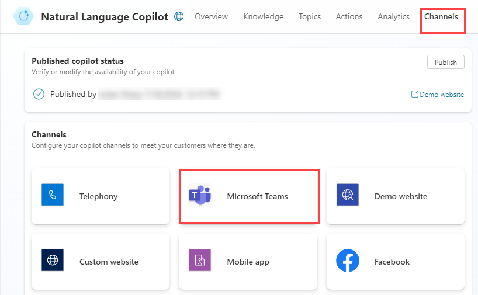

---
lab:
  title: Implementación de Copilot en Microsoft Teams
  module: Create a copilot with Microsoft Copilot Studio and Dataverse for Teams
---

# Implementación de Copilot en Microsoft Teams

## Escenario

En este laboratorio, aprenderás a:

- Creación de acciones de Copilot

## Aprendizaje

- Cómo implementar un Copilot en Microsoft Teams

## Pasos de alto nivel del laboratorio

- Publicar
- Implementación de Copilot en Microsoft Teams
  
## Requisitos previos

- Debes haber completado **Laboratorio: Uso de la IA generativa en Microsoft Copilot Studio**.

## Pasos detallados

## Ejercicio 1: Publicación del Copilot

### Tarea 1.1: Publicar el contenido más reciente

1. Ve al portal `https://copilotstudio.microsoft.com` de Microsoft Copilot Studio y asegúrate de que estás en el entorno adecuado.

1. Selecciona **Copilotos** en el panel de navegación izquierdo.

1. Selecciona el Copilot que has creado en el laboratorio anterior.

1. Selecciona **Publicar** y vuelve a seleccionar **Publicar**.

   

   > **Nota:** La publicación puede tardar unos minutos.

## Ejercicio 2: Canales

Con el copiloto publicado, puedes hacer que esté disponible para los usuarios de Teams. De esta forma, tus compañeros de equipo y otras personas de la organización pueden interactuar con él.

### Tarea 2.1: Canal de Microsoft Teams

1. Con tu Copilot abierto en Microsoft Copilot Studio, selecciona la pestaña **Canales**.

    

1. Seleccione el icono **Microsoft Teams**.

    

1. Seleccione **Activar Teams**.

    

1. Seleccione **Opciones de disponibilidad**.

    

1. Selecciona **Copiar vínculo**.

1. Seleccione **Mostrar a mis compañeros de equipo y usuarios compartidos**.

1. Selecciona tu usuario.

1. Selecciona la flecha hacia atrás de la parte superior izquierda del panel.

1. Seleccione **Compartir**.

### Tarea 2.2: Microsoft Teams

1. Ve a Microsoft Teams `https://teams.microsoft.com`en una nueva pestaña.

1. Inicia sesión en Teams si se te solicita.

1. Selecciona **Teams** en la barra de navegación de la izquierda.

1. Verás un equipo denominado **Contoso** con un canal **General**.

1. Abre una nueva pestaña y ve al vínculo URL que has copiado en la tarea anterior.

1. Selecciona **Cancelar** en el cuadro de diálogo de **Este sitio está intentando abrir Microsoft Teams**.

1. Selecciona **Usar la aplicación web en su lugar**.

1. Seleccione **Agregar**.

    

1. Probar el Copilot.

    
