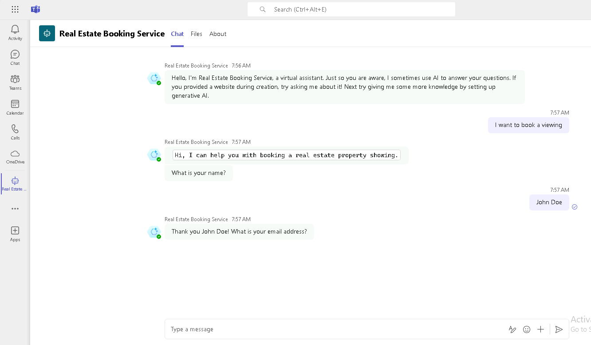

---
lab:
  title: "Implementación de un agente en Microsoft\_Teams"
  module: Create an agent with Microsoft Copilot Studio and Dataverse for Teams
---

# Implementación de un agente en Microsoft Teams

## Escenario

En este ejercicio, aprenderás a:

- Implementar un agente en un canal de Microsoft Teams

Este ejercicio tardará aproximadamente **10** minutos en completarse.

## Aprendizaje

- Implementación de un agente en Microsoft Teams

## Pasos de alto nivel del laboratorio

- Publicar
- Implementación de un agente en Microsoft Teams
  
## Requisitos previos

- Debes haber completado **Laboratorio: Uso de la IA generativa en Microsoft Copilot Studio**.

## Pasos detallados

## Ejercicio 1: Publicación del agente

### Tarea 1.1: Publicar el contenido más reciente

1. Ve al portal `https://copilotstudio.microsoft.com` de Microsoft Copilot Studio y asegúrate de que estás en el entorno adecuado.

1. Selecciona **Agentes** en el panel de navegación de la izquierda.

1. Selecciona el agente que has creado en el laboratorio anterior.

1. Selecciona **Publicar** y vuelve a seleccionar **Publicar**.
   > **Nota:** la publicación puede tardar unos minutos.

## Ejercicio 2: Canales

Con tu agente publicado, puedes hacer que tu agente esté disponible para los usuarios de Teams. De esta forma, tus compañeros de equipo y otras personas de la organización pueden interactuar con él.

### Tarea 2.1: Canal de Microsoft Teams

1. Con tu agente abierto en Microsoft Copilot Studio, selecciona la pestaña **Canales**.

1. Selecciona el icono de **Teams y Microsoft 365 Copilot**.

1. Selecciona **Agregar canal**.

1. Selecciona **Opciones de disponibilidad**.

    

1. Selecciona **Ver agente en Teams**

1. Selecciona **Cancelar** en el cuadro de diálogo de **Este sitio está intentando abrir Microsoft Teams**.

1. En el menú emergente, seleccione **Cancelar** y seleccione **Usar la aplicación web en su lugar**.

1. Seleccione **Agregar** para agregar el agente a Teams.

    

1. Seleccione **Open** (Abrir).

1. Prueba el agente.

    
